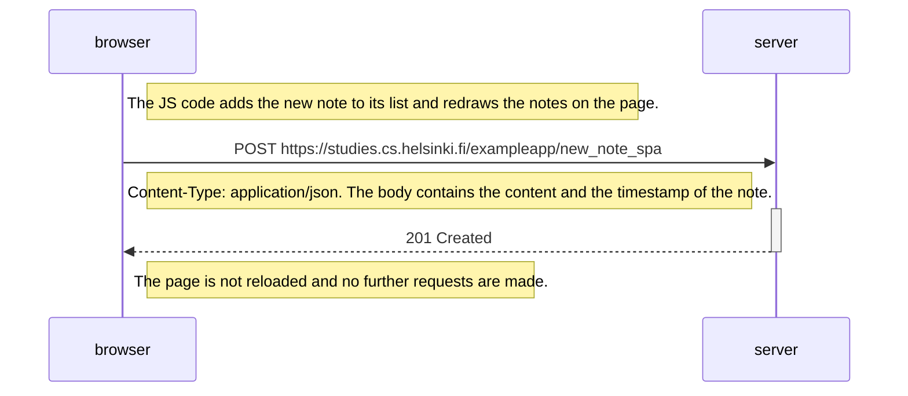

```mermaid
sequenceDiagram
    participant browser
    participant server

    Note right of browser: The JS code adds the new note to its list and redraws the notes on the page.
    browser->>server: POST https://studies.cs.helsinki.fi/exampleapp/new_note_spa

    Note right of browser: Content-Type: application/json. The body contains the content and the timestamp of the note.

    activate server
    server-->>browser: 201 Created
    deactivate server

    Note right of browser: The page is not reloaded and no further requests are made.
```
